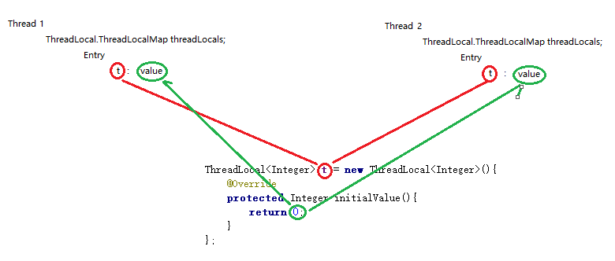

# ThreadLocal

## ThreadLocal

　　ThreadLocal 提供线程局部变量，即为使用相同变量的每一个线程维护一个该变量的副本。当某些数据是以线程为作用域并且不同线程具有不同的数据副本的时候，就可以考虑采用 ThreadLocal，比如数据库连接 Connection，每个请求处理线程都需要，但又不相互影响，就是用 ThreadLocal 实现。

### 为何要Entry使用用弱引用

　　如果强引用，即使ThreadLocal对象为null ，ThreadLocalMap的key依旧会指向ThreadLocal对象，会造成内存泄漏。使用弱引用依旧会造成内存泄漏，如果key释放，value没有释放依旧会造成内存泄漏，在不需要时进行ThreadLocal.remove操作。

　　分析

　　​​

* 在 ThreadLocal 类中定义了一个 ThreadLocalMap，
* 每一个 Thread 都有一个 ThreadLocalMap 类型的变量 threadLocals
* threadLocals 内部有一个 Entry，Entry 的 key 是 ThreadLocal 对象实例，value 就是共享变量副本
* ThreadLocal 的 get 方法就是根据 ThreadLocal 对象实例获取共享变量副本
* ThreadLocal 的 set 方法就是根据 ThreadLocal 对象实例保存共享变量副本
